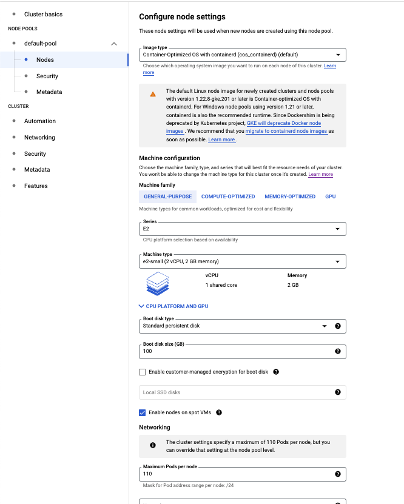

# Proof of concept for GKE + Redis

## GCP Configuration

### Default VPC network, subnet

Created a `default` VPC network to be able to initialize the GKE cluster.

I have created a new subnet under the `default` VPC with the following configuration.

### GKE Cluster

I've created a GKE cluster called `cluster-1` in `us-central1-c` zone. The following images shows the configuration details. I have selected the `GKE Standard` option and I set the default settings everywhere except the on the Networking tab. I have selected the `app-network` which was created using the terraform resources. See [terraform/README.md](terraform/README.md)

The size of the cluster is currently 1 VM with `e2-medium` machine type.

#### Node-pool

#### Node pool security configuration

#### Cluster basics

#### Automation

#### Networking

#### Security

#### Features

### Memorystore configuration

I have manually enabled Memorystore to be able to create the instance with Terraform resources. I could enable it using terraform, but the easiest way was this.

### Container Registry

I have manually enabled Container Registry to be able to store container images. It is required to deploy the services to the GKE cluster.

#### Terraform README.md

Read more about the terraform resources here: [terraform/README.md](terraform/README.md)

#### Application README.md

Read more about the application here:
[app/README.md](app/README.md)
