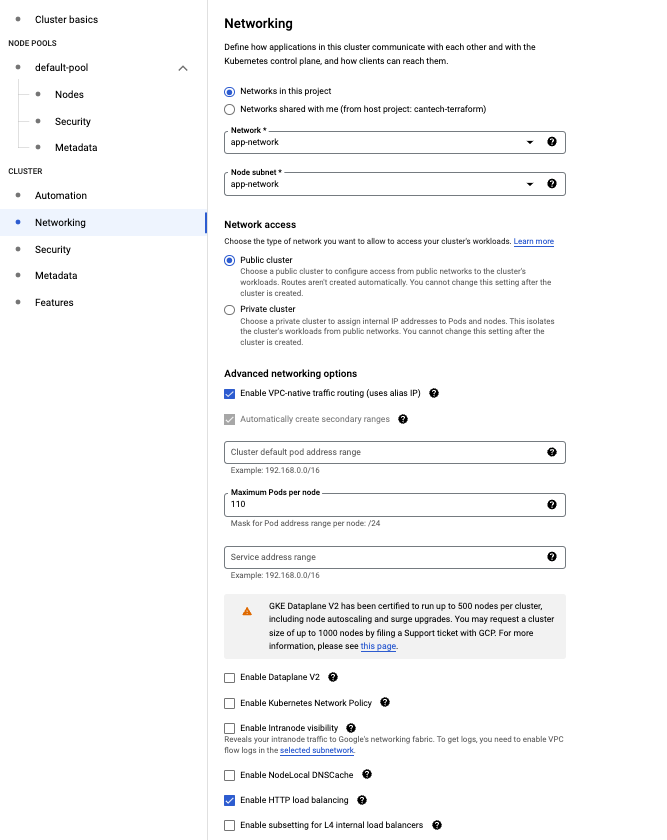

# Proof of concept for GKE + Redis

## GCP Configuration

### Default VPC network, subnet

Created a `default` VPC network to be able to initialize the GKE cluster.

I have created a new subnet under the `default` VPC with the following configuration.

### GKE Cluster

I've created a GKE cluster called `cluster-1` in `us-central1-c` zone. The following images shows the configuration details. I have selected the `GKE Standard` option and I set the default settings everywhere.

The size of the cluster is currently 1 VM with `e2-medium` machine type.

#### Cluster basics

#### Automation

#### Networking

#### Security

#### Features

