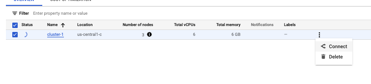

# Proof of concept for GKE + Redis

## Python example APP

This folder contains the app files including the python script in `main.py`, the `Dockerfile` to containeralize the Python application, the Kubernetes file `k8s.yaml` and also a `deploy.sh` file which builds and deploys the app to the GKE cluster.

### Prerequisites

#### gcloud cli initialization

First you will need to install `gcloud` cli. Open the documentation and follow the instructions [here](https://cloud.google.com/sdk/docs/install).

After installing the `gcloud` cli, you need to init the project using the following command:

```bash
$ gcloud init
Welcome! This command will take you through the configuration of gcloud.

Settings from your current configuration [upwork1] are:
core:
  account: csaba.ujvari@commitsmart.com
  disable_usage_reporting: 'False'
  project: engineer-cloud-nprod

Pick configuration to use:
 [1] Re-initialize this configuration [upwork1] with new settings
 [2] Create a new configuration
```

Select the option you want to continue with. You will need to choose the account you would like to use to perform operations. You will need to login with the selected account. `gcloud` will list the GCP projects which are available for the selected account. Select `engineer-cloud-nprod`. Optionally you can set a default Compute Region and Zone.


Run the following command to be able to push new version to gcr.io:

```bash
$ gcloud auth configure-docker
```

#### Connect to cluster

Configure the kube-context for being able to communication with the k9s api.



```bash
$ gcloud container clusters get-credentials cluster-1 --zone us-central1-c --project engineer-cloud-nprod

```


#### Build and Deploy app

Run the following command to deploy the app to the GKE cluster.

```bash
$ PROJECT_ID=engineer-cloud-nprod CONTEXT_NAME=gke_engineer-cloud-nprod_us-central1-c_cluster-1 NAMESPACE=default ./deploy.sh
```
